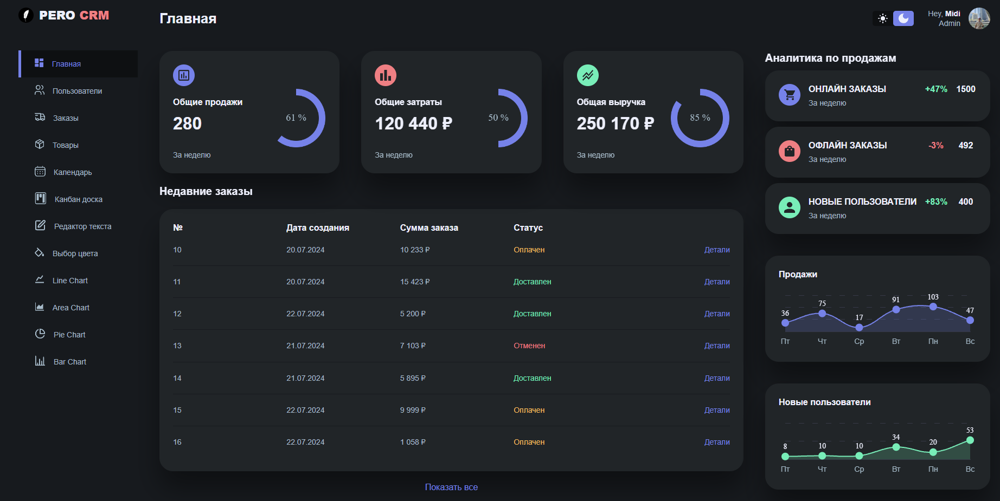
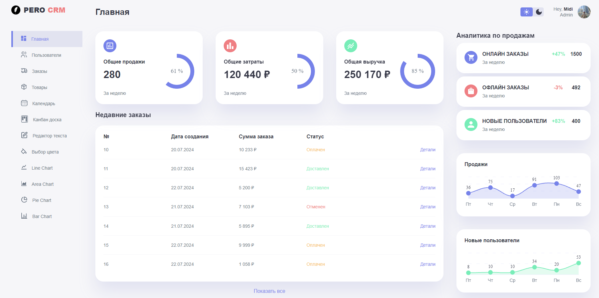
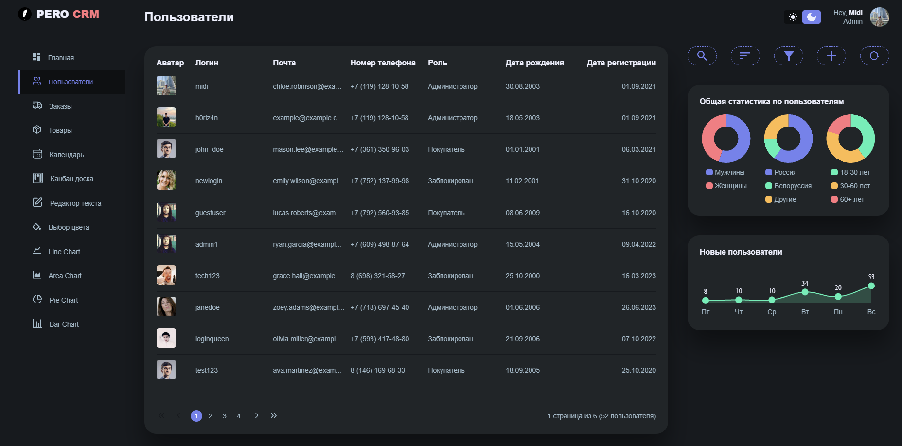
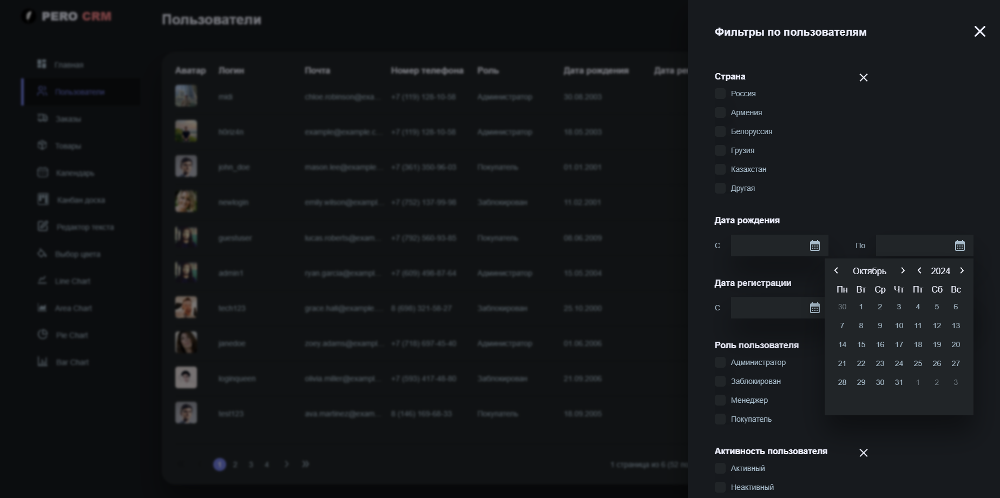
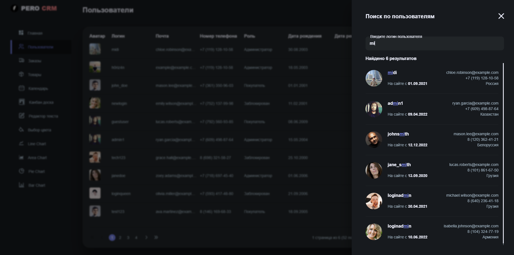
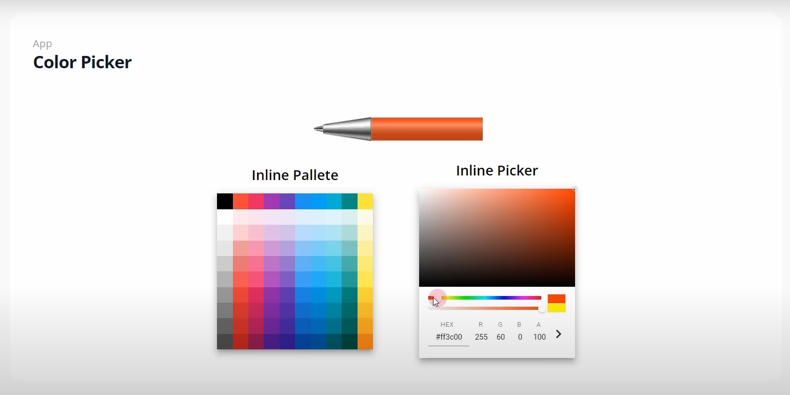
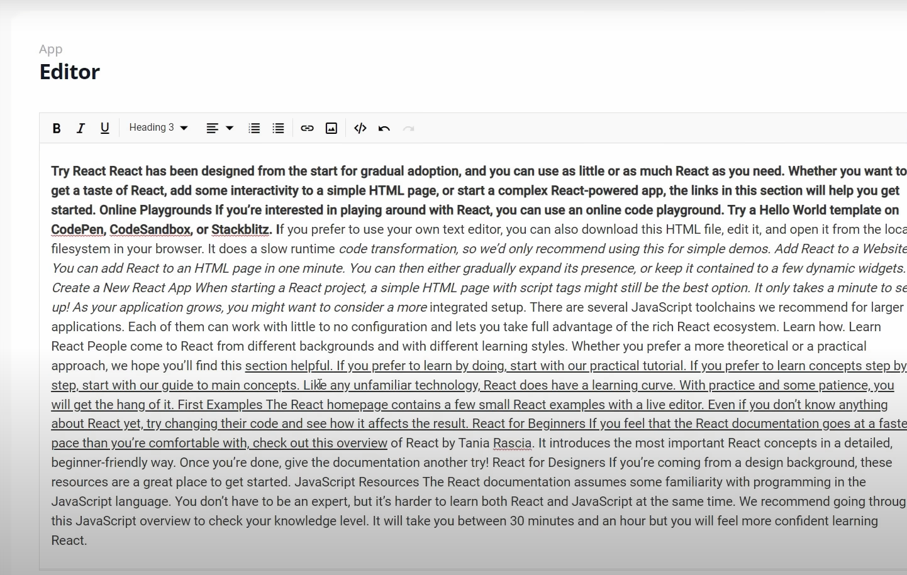

# PERO-CRM

Админ-панель для интернет-магазина PERO. Включает в себя управление всеми пользователями сайта, товарами, заказами, а также предоставляет множество инструментов для аналитики, просмотра и редактирования контента.

## Стек технологий:
- TypeScript
- Vue.js
- Vue Router
- Pinia
- Axios
- Chart.js
- SCSS
- JSDoc

## Возможности сайта:

#### Функционал по всему сайту:
- Смена тёмной/светлой темы
- Авторизация
- Навигация, маршрутизация
- Различная анимация на страницах

#### Страницы "Пользователи, Товары, Заказы":
- Возможность просмотра данных в удобном для пользователя виде.
- Возможность просмотра краткой аналитики/статистики.
- Фильтрация, пагинация, поиск по данным.
- Добавление, удаление и редактирование данных.

#### Страница "Календарь":
Реализация календаря с возможностью выбора различных периодов, планом задач, несколькими режимами отображения.

#### Страницы "Line Chart, Area Chart, Pie Chart, Bar Chart":
Реализация страниц с различными графиками, созданными с помощью библиотеки Chart.js.

#### Страница "Канбан доска":
Реализация канбан доски для планирования задач с механизмом Drag-and-Drop.

#### Страницы "Редактор текста, Выбор цветов":
Реализация редактора текста, в котором можно ввести текст и изменить его различные параметры: толщину, шрифт, размер, отступы.
Реализация выбора цвета с пипеткой, которая копирует в буфер обмена выбранный пользователем цвет.

## Скриншоты сайта:
- Главная страница

- Главная страница (светлая тема)

- Пользователи

- Пользователи (редактирование и просмотр данных)

- Пользователи (фильтры и календарь)

- Пользователи (поиск)

- Выбор цвета

- Редактор текста
